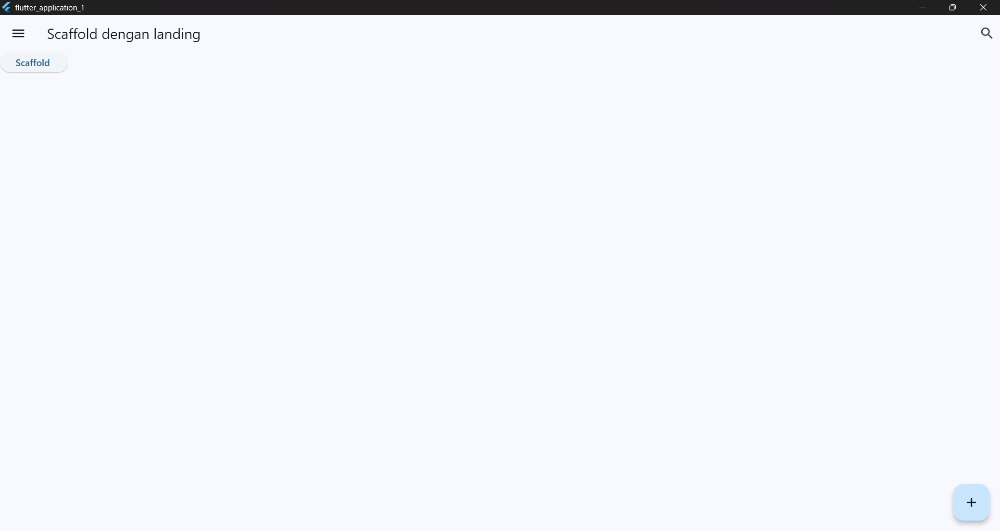
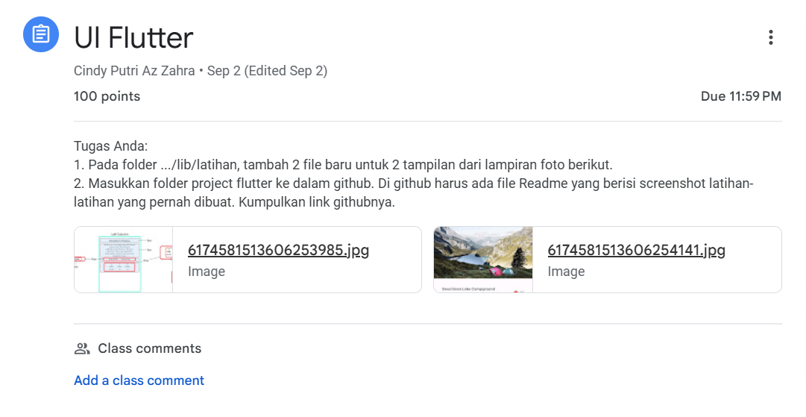
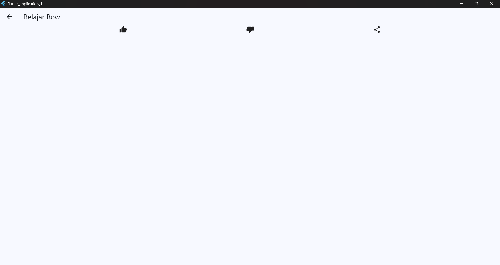
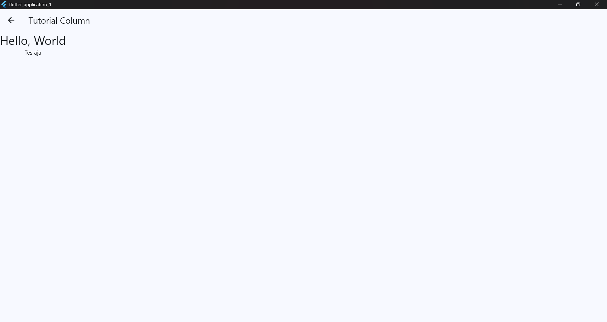
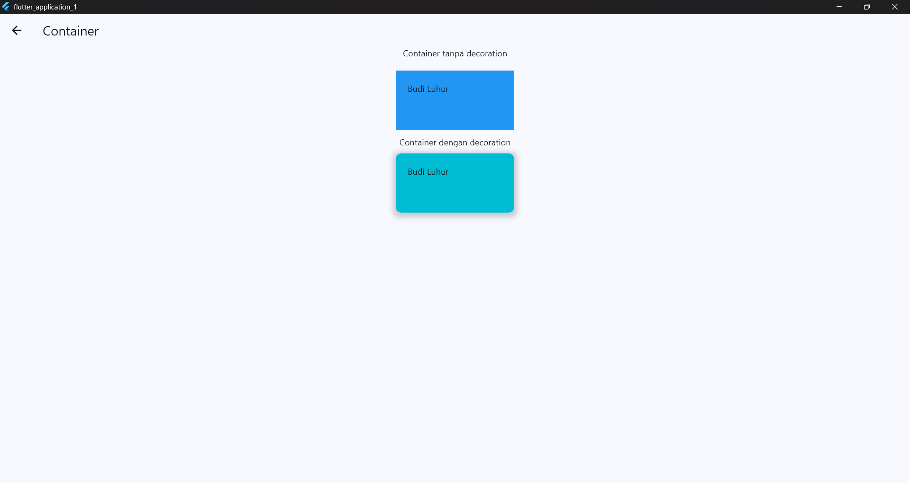
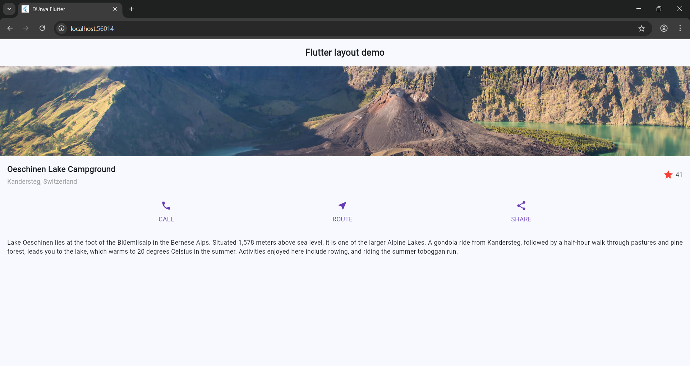

# 📱 Flutter Layout

Proyek ini adalah contoh dasar **Flutter Layout** untuk membantu memahami cara membangun tampilan aplikasi dengan Flutter.  
Cocok digunakan sebagai titik awal dalam mengembangkan aplikasi Flutter baru.

---

## 🚀 Berikut lampiran Screenshot latihan Flutter

### 📌 Tampilan Menu

### 📌 Tampilan Scaffold

### 📌 Tampilan Row

### 📌 Tampilan Column

### 📌 Tampilan Container

### 📌 Tampilan Strawberi Pavlova

### 📌 Tampilan Gunung Layout

---
